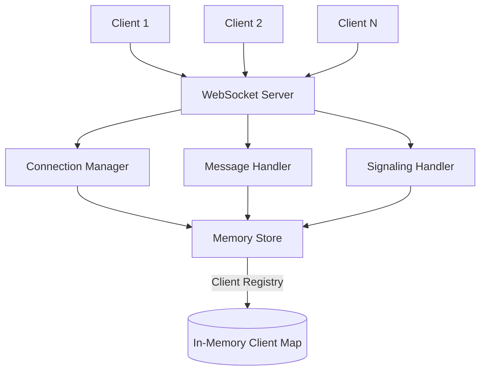
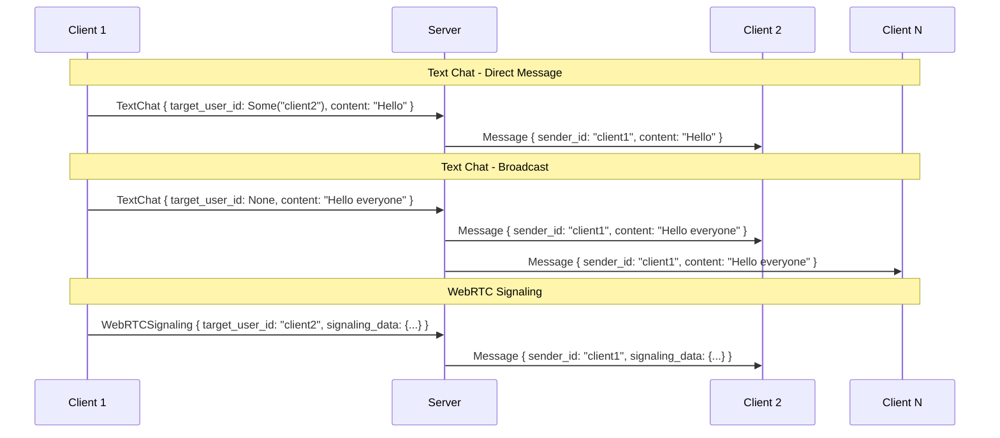

# Design Document

## Overview

The WebSocket Chat and Signaling Server is a unified Rust-based server that handles both text chat messaging and WebRTC signaling through WebSocket connections. The server maintains client connections in-memory and supports direct messaging, broadcast messaging, and WebRTC signaling data forwarding without persistent storage.

## Architecture

### High-Level Architecture



### Core Components

1. **WebSocket Server**: Entry point handling WebSocket connections using `tokio-tungstenite`
2. **Connection Manager**: Manages client lifecycle (connect, disconnect, cleanup)
3. **Message Handler**: Processes text chat messages (direct and broadcast)
4. **Signaling Handler**: Processes WebRTC signaling data (ICE/SDP)
5. **Memory Store**: In-memory storage for active client connections
6. **Configuration Manager**: Handles environment variable configuration

## Components and Interfaces

### WebSocket Server

```rust
// Main server structure
pub struct WebSocketServer {
    addr: SocketAddr,
    clients: Arc<RwLock<ClientRegistry>>,
    config: ServerConfig,
}

impl WebSocketServer {
    pub async fn start(&self) -> Result<(), ServerError>;
    pub async fn handle_connection(&self, stream: TcpStream) -> Result<(), ConnectionError>;
}
```

### Connection Manager

```rust
pub struct ConnectionManager {
    clients: Arc<RwLock<ClientRegistry>>,
}

impl ConnectionManager {
    pub async fn add_client(&self, client: Client) -> ClientId;
    pub async fn remove_client(&self, client_id: &ClientId);
    pub async fn get_client(&self, client_id: &ClientId) -> Option<Client>;
    pub async fn get_all_clients(&self) -> Vec<ClientId>;
}
```

### Message Types

```rust
#[derive(Debug, Clone, Serialize, Deserialize)]
pub enum MessageType {
    TextChat {
        target_user_id: Option<ClientId>,
        content: String,
    },
    WebRTCSignaling {
        target_user_id: ClientId,
        signaling_data: serde_json::Value,
    },
    GenericMessage {
        target_user_id: ClientId,
        content: String,
    },
    SystemMessage {
        message_type: SystemMessageType,
        content: String,
    },
}

#[derive(Debug, Clone, Serialize, Deserialize)]
pub struct Message {
    pub id: MessageId,
    pub sender_id: Option<ClientId>,
    pub timestamp: DateTime<Utc>,
    pub message_type: MessageType,
}
```

### Client Registry

```rust
pub type ClientId = String;

#[derive(Debug, Clone)]
pub struct Client {
    pub id: ClientId,
    pub sender: UnboundedSender<Message>,
    pub connected_at: DateTime<Utc>,
}

pub type ClientRegistry = HashMap<ClientId, Client>;
```

## Data Models

### Core Data Structures

1. **Client**: Represents a connected WebSocket client

   - `id`: Unique identifier (UUID v4)
   - `sender`: Channel for sending messages to client
   - `connected_at`: Connection timestamp

2. **Message**: Universal message structure

   - `id`: Unique message identifier
   - `sender_id`: Optional sender client ID
   - `timestamp`: Message creation time
   - `message_type`: Enum defining message category and payload

3. **ServerConfig**: Configuration loaded from environment
   - `bind_address`: Server bind address (default: "127.0.0.1")
   - `port`: Server port (default: 8080)
   - `max_connections`: Maximum concurrent connections (default: 1000)

### Message Flow



## Error Handling

### Error Types

```rust
#[derive(Debug, thiserror::Error)]
pub enum ServerError {
    #[error("Failed to bind to address: {0}")]
    BindError(#[from] std::io::Error),

    #[error("Configuration error: {0}")]
    ConfigError(String),

    #[error("Connection error: {0}")]
    ConnectionError(#[from] ConnectionError),
}

#[derive(Debug, thiserror::Error)]
pub enum ConnectionError {
    #[error("WebSocket error: {0}")]
    WebSocketError(#[from] tokio_tungstenite::tungstenite::Error),

    #[error("Client not found: {0}")]
    ClientNotFound(ClientId),

    #[error("Invalid message format: {0}")]
    InvalidMessage(String),

    #[error("Message delivery failed: {0}")]
    DeliveryFailed(String),
}
```

### Error Response Strategy

- **Client Errors**: Send error message back to sender with error details
- **Server Errors**: Log error and attempt graceful degradation
- **Connection Errors**: Clean up client state and close connection
- **Message Parsing Errors**: Send format error response to sender

## Testing Strategy

### Unit Tests

- **Connection Manager**: Test client registration, removal, and lookup
- **Message Handlers**: Test message routing logic for different message types
- **Configuration**: Test environment variable parsing and defaults
- **Error Handling**: Test error scenarios and response generation

### Integration Tests

- **WebSocket Connection**: Test client connection and disconnection flows
- **Message Delivery**: Test direct messaging and broadcast functionality
- **Signaling Flow**: Test WebRTC signaling message forwarding
- **Concurrent Connections**: Test multiple simultaneous client connections

### Test Data

- Mock WebSocket connections using `tokio-test`
- Predefined message payloads for different scenarios
- Configuration test cases with various environment setups

## Implementation Dependencies

### Required Crates

```toml
[dependencies]
tokio = { version = "1.0", features = ["full"] }
tokio-tungstenite = "0.20"
serde = { version = "1.0", features = ["derive"] }
serde_json = "1.0"
uuid = { version = "1.0", features = ["v4"] }
chrono = { version = "0.4", features = ["serde"] }
thiserror = "1.0"
tracing = "0.1"
tracing-subscriber = "0.3"
dotenv = "0.15"

[dev-dependencies]
tokio-test = "0.4"
```

### Environment Configuration

```bash
# .env.sample
SERVER_BIND_ADDRESS=127.0.0.1
SERVER_PORT=8080
MAX_CONNECTIONS=1000
LOG_LEVEL=info
```

## Deployment Considerations

- **Memory Usage**: In-memory client storage scales with concurrent connections
- **Connection Limits**: Configurable maximum connections to prevent resource exhaustion
- **Graceful Shutdown**: Proper cleanup of client connections on server shutdown
- **Logging**: Structured logging for monitoring and debugging
- **Health Checks**: Basic health endpoint for deployment monitoring
